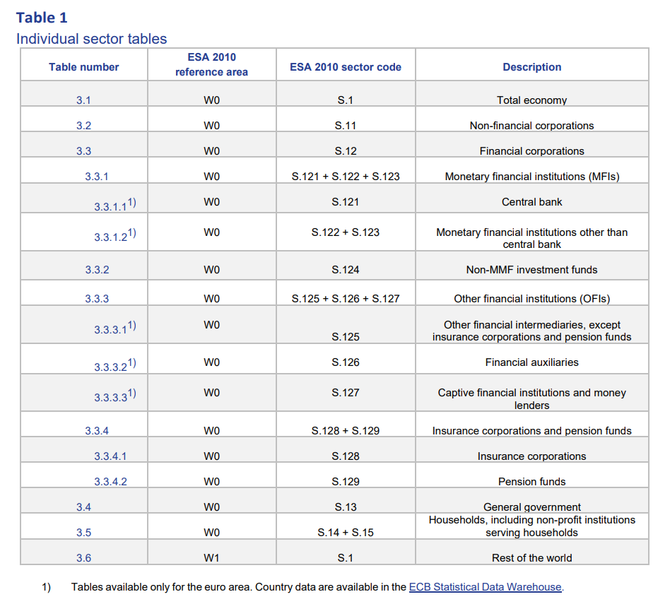
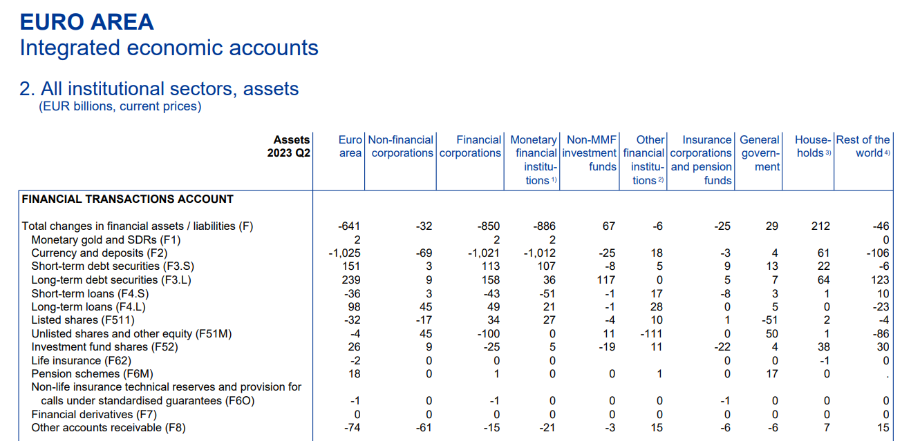

# Institutional accounts

## Intititutional sectors

## Financial accounts

Definitions and explanations taken from the [ECB handbook](https://www.ecb.europa.eu/stats/pdf/eaa/Handbook_on_quarterly_financial_accounts.pdf).

The financial accounts are split into eight categories that are briefly described below.

### F.1 - Monetary gold and SDRs

* F.11 - Monetary gold: Foreign reserves held in gold by a "monetary authority".
* F.12 - Special Drawing Rights (SDRs) represent a special reserve asset created by the IMF that countries can utilized to supplement national reserves. SDRs are a weighted average of five currencies, US Dollar, Euro, Chinese Renminbi, Japanese Yen, and Pound Sterling. The SDR have its own interest rate. [More info](https://www.imf.org/en/About/Factsheets/Sheets/2023/special-drawing-rights-sdr).

### F.2 - Currency and deposits

* F.21 - Currency: Notes and coins issued by domestic and foreign monetary authorities. Always recoded in nominal value since they are used for direct purchases. Foreign currency is converted into domestic currency using the exchange rate at the date of the balance sheet recoding. 

* F.22 - Transferable deposits: Overnight deposits in national or foreign currency held in banks. Can be quickly converted to physical currency or for immediate payments.
* F.29 - Other deposits: Claims on the central bank, other than transferable deposits, that can be used for making payments. These includes saving accounts, term deposits, loan associations, building sociesties, credit uniotns etc. Valued at amount of principle the debtor is contratually obliged to repay the creditor including accrued interest rate.

### F.3 - Debt securities

* Securities other than shares: These are negotiable instruments traded in secondary markets and does not grant the holder any ownership right in the insitution issuing them.

* F.33 - Debt securities: Intruments which give the holder the unconditional right to a fixed or contractually determined variable money income in the form of interest payments and/or a stated fixed sum on specified dates. Debt securities can be short term (maturity less than or equal to one year) which includes treasury bills, commercial paper, certificates of deposits, etc. Or long term (maturity more than one year) which includes bonds, floating rate notes, negotiable and tradable loans on secondary markets, etc.

### F.4 - Loans

* Created when creditors lend funds to debtors. Depends on conditions set by the governing authority or terms agreed upon through a broker. Loans is an unconditional interest-bearing debt that has to be paid back at the time of maturity.